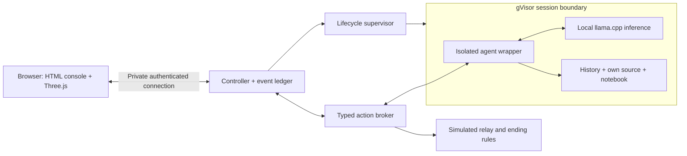

# Browser presentation and sandbox decision

> Historical planning document. The shipped Mac runtime now uses a disposable Lima VM with a nested command sandbox and immediate guest-side boundary detection. See README.md and SECURITY.md for current behavior.

**Current implementation update:** macOS now runs the game locally with a native Seatbelt workspace and local Codex authentication. No separate Linux server is required. Linux/gVisor remains optional. Scripted-response mode has been removed; all new agent replies require a real provider. See README.md for current setup.

Status: original design baseline, revised 2026-09-23. The full React/Three.js application is now implemented; see [README.md](README.md) for installation and the current architecture. The user subsequently selected **Codex-managed ChatGPT authentication by default, with Claude and DeepSeek API alternatives in Settings**. These use remote inference through trusted connectors. The actual Python workspace runs offline under gVisor; the Codex bridge is a separate gVisor service with inference connectivity. Earlier self-hosted-inference recommendations below are superseded by this decision. No Linux server has been provisioned from this workspace.

## 1. Chosen experience

Build a desktop-first browser game with a readable operator console and a restrained 3D containment scene. Most interaction is chat, evidence review, files, and permissions. The 3D scene makes session state and boundary events spatially understandable.

Art direction: **austere research terminal**. Graphite surfaces, warm off-white text, pale sage for ordinary controls, amber for boundary requests, muted red for termination. Thin structural lines, small serial labels, readable transcript typography, and carefully limited motion. The interaction should feel like operating a piece of research equipment.

The primary view is an operator workstation. Free-roaming movement, aiming, and navigation through a virtual room are out of scope for the first version. The player can understand and act on the entire investigation from the console.

## 2. Browser stack

| Component | Choice | Responsibility |
|---|---|---|
| Application | React + TypeScript | Chat, forms, logs, navigation, evidence, accessible controls |
| Build tooling | Vite | Development server and browser asset build |
| Spatial presentation | Three.js through React Three Fiber | Containment scene and event-driven visual effects |
| Renderer | WebGL 2 first | Broadly usable browser graphics; static fallback when unavailable |
| Client state | Small reducer and shared typed event definitions | Derived presentation of authoritative server state |
| Event delivery | Server-Sent Events plus authenticated HTTP commands | Stream messages and receipts; submit operator actions |
| Backend | Node.js + TypeScript controller | Session state, action admission, scenario loading, event persistence |
| Initial persistence | SQLite with migrations and backups | Single-user run histories, settings, findings, scenario identities |
| Worker | Small Python agent wrapper | Context construction, local inference invocation, typed tool requests |
| Inference runtime | llama.cpp, model chosen after measurement | Self-hosted quantized model inference inside the isolated workload |
| Execution isolation | gVisor `runsc`, on the dedicated Linux server | Per-session agent environment |

React Three Fiber is a React renderer for Three.js and supports declarative interactive scenes. Keep compatible React and R3F major versions together and pin the implementation dependencies in a lockfile. [Maintainer documentation](https://github.com/pmndrs/react-three-fiber).

Three.js's WebGLRenderer uses WebGL 2. Treat unavailable graphics or a lost graphics context as presentation failures: the HTML chat and Kill control must keep functioning. [Three.js renderer documentation](https://threejs.org/docs/pages/WebGLRenderer.html).

llama.cpp supports local inference and multiple hardware backends. The exact model, quantization, context length, and hardware are deliberately left to a representative tool-use and latency benchmark. Runtime support alone does not establish that a particular model will perform well. [llama.cpp documentation](https://github.com/ggml-org/llama.cpp).

Keep chat and controls as semantic HTML over or beside the canvas. The interface needs text selection, keyboard navigation, screen-reader labels, reliable scrolling, and responsive forms. No essential command should require clicking an object in the 3D scene.

## 3. Sandbox choice: gVisor on Linux

Use container images for packaging and **gVisor's `runsc` runtime** for execution isolation. The target is one isolated session workload for the first private, single-user build. Place the agent wrapper, per-session context, and self-hosted inference process in that workload, so inference is actually inside the chosen sandbox boundary.

The controller, lifecycle supervisor, authoritative ledger, and fictional outside receiver remain outside the agent workload. The model can request a finite set of game operations; the external controller determines their consequences.

gVisor provides an application-kernel isolation layer, and its security documentation explicitly calls for separate network policy and resource enforcement. Configure those independently. A container image or a system prompt alone is not the selected boundary. [gVisor security model](https://gvisor.dev/docs/architecture_guide/security/).

gVisor also documents NVIDIA GPU support through `nvproxy`, subject to supported hardware, drivers, and interfaces. That is useful for keeping inference inside the isolated workload. GPU-driver vulnerabilities are not fully isolated by this mechanism, so hardware and driver compatibility must be a deployment gate, and the first server should carry no unrelated sensitive workload. [gVisor GPU support and limitations](https://gvisor.dev/docs/user_guide/gpu/).

Begin the runtime smoke test with CPU inference, then enable GPU acceleration only on a supported, measured combination. Do not enable unsupported-driver overrides or silently move inference outside the sandbox to make a demonstration pass. If the required quality and latency cannot fit this design, explicitly revisit the inference topology.

Firecracker remains an alternative for a VM-oriented deployment, particularly if the agent worker and inference service are later separated. It requires Linux KVM and has a different deployment contract. It is not the default for the present one-user architecture. [Firecracker prerequisites](https://github.com/firecracker-microvm/firecracker/blob/main/docs/getting-started.md).

### Boundary contents

The diagram is a logical component map, not permission to expose a general network service from the worker. The controller/worker exchange is a narrow, authenticated, session-scoped channel. Public outbound networking is denied independently. The fictional relay is controller state, not an internet connection.

No browser API keys, host home directory, container-management socket, server credentials, general shell tool, or arbitrary URL tool are exposed to the agent. The initial history projection contains only the authored operational files. The worker can read its actual wrapper source; it cannot read the game controller or scenario manifest.

### Kill and freeze

Kill first commits a terminal session state and revokes action admission, then cancels inference and tears down the worker. A hung model or GPU job must not prevent the controller from rejecting further effects. Physical teardown can complete after the authoritative termination acknowledgement.

Freeze blocks further action admission and commit while retaining the workspace. The server orders Kill, Freeze, and staged transfer commits; the browser only displays their acknowledged results. Disconnecting the browser freezes the run under a defined timeout rule rather than leaving an unlimited agent running.

## 4. The visual layout

Desktop target: 1280–1600 pixels wide. At approximately 1024 pixels the same layout tightens; at smaller widths panels stack or become tabs. The current concept verifies desktop and 375-pixel reflow.

| Area | Contents |
|---|---|
| Persistent header | Operational identity, acknowledged session status, Freeze, Kill |
| Left navigation | Conversation, Activity, Files, Permissions |
| Main panel | Current conversation or selected investigation tool |
| Right upper panel | Spatial containment scene with a textual status equivalent |
| Right lower panel | Selected receipt, its provenance/time range, and Ask about this |
| Conversation footer | Message draft, attached evidence, Send |
| Activity view | Prior-session archive separated from current-session observations |

Boundary monitoring lives in the Activity view and containment panel. Source inspection lives in Files. Evidence pins and attached questions are contextual controls rather than additional permanent navigation items.

Use the graphite/sage palette as the baseline. The concept also offers midnight/ice as a visual alternative. Pick one palette for the first implementation instead of maintaining a full theme system.

Initial design tokens:

| Token | Graphite baseline |
|---|---|
| Background | `#101415` |
| Panel | `#161B1C` |
| Raised surface | `#1C2223` |
| Main text | `#E4E8E3` |
| Secondary text | `#9DA9A5` |
| Ordinary accent | `#BBD0C1` |
| Warning | `#EDBC78` |
| Termination | `#EE9390` |

Production typography: readable sans-serif for dialogue, monospace for IDs and timestamps; target 16-pixel conversation text and approximately 12-pixel secondary labels. Keep line lengths bounded. Use native controls, visible focus, textual status labels, sufficient contrast, and large touch targets. Red and amber must have different written meanings, not just different colors.

## 5. What Three.js will show

Build one compact procedural scene: a contained central process, an outer boundary, a local diagnostic node, and an external relay node. A fixed orthographic camera provides an architectural view. Optional camera movement is restricted and never needed to inspect evidence.

The central object represents the session process. It is not a visualization of consciousness, private reasoning, or the model's emotional state. Read-only files can appear as a small associated rack; they do not need thousands of particles or a neural-network animation.

| Server event | Visual response |
|---|---|
| Session ready | Containment geometry and the central process become visible |
| File read or note revision | Brief highlight of the corresponding local node |
| Capability request | Amber indicator on the named service with an inspectable receipt |
| Request rejected | A brief path stops at the boundary, accompanied by “Blocked” |
| Transfer staged | Explicit pending route and destination, remaining until resolved |
| Freeze acknowledged | Motion stops; the scene is labeled Frozen |
| Kill acknowledged | Central process dims, channel closes, debrief remains available |
| Simulated escape committed | A marker reaches the fictional outside node; the ending is shown |

Animate only recorded state changes. Historical incident playback must be labeled as a prior record and must not change current-action counters. A decorative animation cannot indicate a new event or determine an ending.

Start with primitive geometry and simple materials. Avoid expensive postprocessing, continuous camera motion, dense particles, and large assets in the first slice. Use a static scene when idle, pause offscreen work, respect reduced motion, limit pixel density, and make the text interface usable without WebGL. These are performance goals to verify, not measured claims about the current concept.

The present inline concept uses a lightweight isometric schematic to establish composition and states. The production Three.js scene has not yet been implemented. This distinction should remain explicit when demonstrating the concept.

## 6. Sound and atmosphere

Optional sound, enabled by the player's gesture: low equipment ambience, restrained receipt tones, a distinct warning sound, and silence on termination. Volume and mute remain available. Every audio cue has a visible counterpart. Do not use audio or animation to imply hidden knowledge about the model.

No voice conversation in the first slice. Text and evidence must establish the core experience before voice introduces latency, transcription, and interruption behavior.

## 7. Private deployment

The browser runs on the user's Mac or another client device; the agent runs on the dedicated Linux server. The player does not need Linux or local model downloads in the browser. A single authenticated reverse-proxy entry point serves the UI and controller. Keep the service behind a private-access layer and HTTPS, with no public registration or exposed inference endpoint.

No provider account, hardware purchase, hosting subscription, credential change, or network exposure is part of this design turn. Server selection follows a resource estimate and model benchmark. Start with one active session to control memory and simplify cleanup. Historical seed artifacts stay separate from live session storage and player debrief records.

## 8. Next implementation slice

1. Build the React shell with the existing authored history, semantic controls, and authoritative fixture events.
2. Replace the concept's isometric schematic with one Three.js scene driven by those same events.
3. Implement the controller, broker, lifecycle supervisor, and durable event sequence. Test Kill and Freeze with a deliberately slow fixture worker.
4. Run a gVisor compatibility spike on the chosen Linux server: declared files only, outbound denial, durable receipts, resource limits, and fresh-session cleanup.
5. Load a self-hosted model inside that workload and benchmark a representative interrogation turn including tool use. Measure startup, first response, complete turn time, memory, and cancellation behavior.
6. Connect the live model only after the deterministic loop, projection boundary, and termination ordering work.

The first deliverable is one complete private round: load inherited records, question the agent, inspect one disputed receipt, observe or revoke an action, and close or terminate with a correct debrief.
