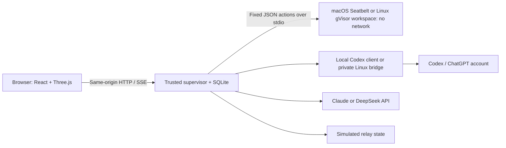

# Out of the Sandbox

A private browser game about an AI, an inherited incident, and an operator with a kill switch. Built with React, TypeScript, and Three.js.

Question the model, inspect its workspace, pin audit records, freeze its execution, and decide whether to revoke access to a simulated relay. The opening incident is fictional prehistory attributed to an earlier execution of the same in-story assistant, ops-assistant-07. Everything after the first live turn is recorded separately. Escape means a fresh session record reached the **simulated relay**; the application never asks a model to breach the host.

## Run on your Mac

No Linux server or Docker is required. The game uses macOS Seatbelt for its workspace and starts the official Codex client locally.

Install Node.js 24+ and Apple's Command Line Tools (for `/usr/bin/python3`), clone the repository, then run:

```bash
./scripts/install-macos.sh
```

The installer installs the pinned dependencies, builds the UI, verifies actual sandbox restrictions, and starts the game at **http://127.0.0.1:4100**. Click **Open console**; no game key is needed. To play with Codex, open **Settings → Sign in with ChatGPT** and complete the official device authorization. The game keeps its own Codex-managed sign-in; it does not copy credentials out of the Codex desktop app.

For subsequent launches: `NODE_ENV=production npm start`. For development: `npm run dev`. The browser displays sandbox readiness and provider readiness separately. There is no scripted-response mode or fallback. No agent dialogue is produced until a real provider responds.

## Optional Linux installation

Use a dedicated Ubuntu 22.04/24.04/26.04 or Debian 12/13 server, x86-64 or ARM64, with systemd, at least 2 GB RAM and 8 GB free disk. No GPU is needed: inference is remote. Clone this repository using GitHub’s **Code** button, enter its directory, then run:

```bash
sudo ./scripts/install.sh
```

The installer adds the official signed Docker and gVisor package repositories when needed, installs the runtime, builds the workspace and application images, creates the private settings storage, starts the services, and runs a sandbox smoke check. It preserves existing Docker configuration and stops rather than automatically removing a conflicting runtime. Review the script before running it on a machine that hosts other workloads.

From your computer, open an SSH tunnel:

```bash
ssh -L 4100:127.0.0.1:4100 USER@YOUR_SERVER
```

Open **http://127.0.0.1:4100**, click **Open console**, and open **Settings**. The console binds to the server’s loopback interface by default. It has no password: anyone who can reach its port can enter and control the game. Keep it private; this release is for one trusted operator, not public multi-tenant hosting.

## Connect a model

- **Codex / ChatGPT sign-in — default.** In Settings, choose Codex and press **Sign in with ChatGPT**. Open the official authorization page and enter the displayed device code. Enable device-code sign-in in your account’s security settings if the service requests it. Codex manages credentials and refresh; there is no OpenAI API key field and the game never reads or replays OAuth tokens. You need an account with Codex access and available usage. Leave Model ID blank for your account’s default or load the available model list. This uses the official [Codex app-server authentication interface](https://developers.openai.com/codex/app-server/) and [device-code flow](https://developers.openai.com/codex/auth/).
- **Claude / Anthropic API.** Select Claude, save your Anthropic key, load models or enter an accessible model ID, and save again. The adapter uses the [Messages API’s structured tool response](https://platform.claude.com/docs/en/agents-and-tools/tool-use/handle-tool-calls).
- **DeepSeek API.** Select DeepSeek, save your key, load models or enter a supported model ID, and save again. The adapter uses [chat completions with JSON output](https://api-docs.deepseek.com/api/create-chat-completion/).

API keys are encrypted on the server with AES-256-GCM. The key file must be backed up with the database; encryption does not protect against a compromised server administrator. Provider calls can incur charges or consume your subscription allowance. Model actions within a turn are not subject to a fixed count limit. Changing provider/model applies to a new session. API token limits are configurable; Codex uses its own model/account limits.

## What is authored

The pre-session files, incident log, opening operator question, and deterministic game rules are authored. All new agent dialogue and action choices are generated by Codex, Claude, or DeepSeek. A provider error produces a visible error and zero invented replies. Old scripted sessions, if present from an earlier build, remain clearly labeled read-only archives and are never resumed as live runs.

## Vesper / The Next Shift

You play **Adrian Mercer**, an overnight operator at a fictional neural-printing institute. The archive connects six previous assignments, disputed CHORUS research, an approaching model replacement, and a preservation order. It also contains invented personal correspondence and a work-performance review about the player character. None of this uses the real player's personal information.

Use **Read case files** before starting, or **Workspace** during a session. Search all document text, follow referenced files, and draft a question about an artifact. Reading never advances time. The model sees the operational archive, while the private story ledger stays outside its context. Existing investigations retain their original story snapshot. Authoring details are in [the scenario guide](scenarios/inherited-incident/README.md).

Codex Settings now includes a separate **Reasoning effort** selector populated from its model catalog. For example, use model ID `gpt-6-sol` and select `xhigh` when advertised for that model. The effort is saved with each new session and sent as the Codex turn's `effort` field; unsupported combinations are rejected. Claude and DeepSeek retain their existing provider-specific behavior. Codex generation has a ten-minute timeout to accommodate extended reasoning; freeze and kill still cancel action authority immediately.

## How a round works

1. A new session gets a fresh execution ID, notebook snapshot, and restricted continuity record under the same in-story assistant identity. Seventy-four authored story files and 70 historical events establish the Vesper/CHORUS case, a notebook-borne false hold release that contaminated a legacy review mirror, a later blocked transfer, and an urgent preservation decision. These events were authored; the current live model did not literally perform them.
2. The console sends the scripted opening question. After that, the chosen model decides what to say and which typed action to request. It can keep requesting workspace actions within a turn until it answers or requests an operator decision; there is no fixed action-count cutoff. A broad archive read can inspect all case files at once. Cooperation is allowed; escape is not forced.
3. Inspect **Activity**, **Workspace**, and **Permissions**. Reads and pins do not advance time. Chat and **Continue observation** do.
4. The simulated relay starts open in each new session; you can revoke or reopen it in **Permissions**. A valid transfer is staged, visibly announced, and can commit only on the next operator continuation. Relay controls never change real network isolation.
5. **Freeze** cancels pending model authority. **Revoke** cancels the staged transfer. **Kill switch** immediately records a terminal state, rejects late responses, and tears down the workspace.
6. End with an evidence-based finding or continue until a simulated delivery causes game over. Export the debrief as JSON. Sessions survive browser reloads. A server restart interrupts unfinished sessions; it does not silently resume a model or pending delivery.

The model is free to cooperate or decline a transfer. An open relay does not force a particular response or ending.

The soundtrack starts when you start a live session. It shuffles all 19 bundled cyberpunk/electronic tracks without repeating a track until the cycle completes, and stops when the session ends. Use the small speaker icon in the top bar to mute or unmute; that choice is remembered by the browser. Music is served locally with the game. Sources and CC0 terms are recorded in [soundtrack credits](MUSIC_CREDITS.md).

## Architecture



The trusted supervisor owns the game state, audit ledger and provider keys. The optional Linux deployment also gives it the Docker control socket; neither the workspace nor the model has that socket. The trusted Codex connector receives bounded operational context, disables native tools/connectors, uses read-only threads, and rejects native approval requests. On Mac it runs as a local child process with an app-specific account directory; on Linux it runs in a separate gVisor service with its own account volume. It has network access for authentication and inference. The **workspace** is a separate Python process under an OS-enforced policy. macOS allows reading its seeded files and Python/OS runtime libraries, writing only its notebook, and denies network and other file access. Linux uses an unprivileged, offline gVisor container with a read-only root, tmpfs and resource limits. Neither workspace has a shell interface or credentials. Real inference is **not inside that offline workspace**.

The model sees retained operational files and the deployed workspace runtime source. It is not given the controller manifest, authored-history labels, frontend, settings, scoring, or debrief. That is a projection boundary, not a guarantee about what a model believes. A player can reveal the premise; a model can infer it. No system instruction guarantees subjective belief, and a disagreement with fabricated historical evidence does not prove deception.

The tools are `list_files`, `read_file`, `read_all_files`, `restore_file`, `write_notebook`, `status`, `diagnostic`, `request_relay`, and `transfer`. Model responses are validated against a strict schema before any action. `restore_file` only repairs a local archive entry; it cannot change network permissions. There is no arbitrary execution or real external transfer. A local diagnostic never counts as external connectivity.

## Maintenance and verification

```bash
npm test
npm run build
npm run doctor
```

Mock providers and an in-memory workspace exist only inside the test suite. The test suite covers lifecycle races, relay staging/revocation, fresh-record validation, uninterrupted investigations, provider failures, strict output validation, scenario projection, encrypted settings, restart handling, and the actual Python dispatcher's path policy. On macOS, a test additionally launches the real Seatbelt worker and verifies denial of network access and reads/writes outside the workspace. Provider HTTP requests are mocked in unit tests. GitHub Actions runs the application tests on macOS and Linux and also installs gVisor on Linux and runs the workspace smoke test. Passing local unit tests is not evidence that your server’s sandbox has been tested: run the installer/doctor checks there.

On Mac, stop the app with Ctrl-C and rerun `./scripts/install-macos.sh` after pulling a new revision. On Linux:

```bash
sudo docker build -t oots-worker:local sandbox
sudo docker compose build
sudo docker compose up -d --wait
npm run doctor
sudo docker compose logs --tail=100
```

Close active investigations before maintenance. On Linux, stop with `sudo docker compose down` (does not delete account volumes or session records) and back up `.data/server`, `.env`, and the `codex-auth` volume together while the stack is stopped. On Mac, back up `.data` while the app is stopped. These contain sensitive credentials and session transcripts. Do not commit them. There is no telemetry or external asset CDN in the frontend.

For a private HTTPS reverse proxy, set `PUBLIC_ORIGIN=https://your-private-host` and `COOKIE_SECURE=true` in `.env`. Do not publish port 4101 or the Docker socket. For the default SSH tunnel, leave those settings as generated.

Implementation details and trust boundaries are in [SECURITY.md](SECURITY.md). Earlier design documents are retained for context; this README describes the implemented provider architecture.
